# brAIn — Brain Tumor Detection Pipeline with LLM Integration

**Mustafa Subhani · Arnau Rey**

Upload a brain MRI slice and this system tells you which of four tumor types
it looks like — but it doesn't stop at the label. It shows you how sure it is,
where in the image it was looking, where the tumor is and how big, whether its
answer survives being challenged, and finally writes the whole thing up in
plain words you can read or argue with.

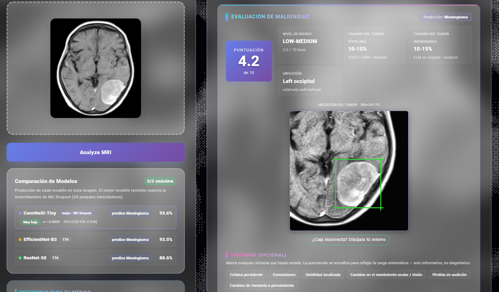

> **Research / educational project.** Not a medical device. Not validated by
> any regulatory authority. Not for clinical decision-making.

**[Why it exists](#1-why-this-project-exists)** ·
**[What you get](#2-what-the-system-does)** ·
**[See it working](#3-see-it-working)** ·
**[How it works](#4-how-it-works-step-by-step)** ·
**[Run it yourself](#7-first-time-setup)** ·
**[Results](#11-results-in-detail)** ·
**[Limitations](#12-limitations--future-work)**

For the full write-up — motivation, related work, methodology and detailed
results — see [`paper/brAIn_paper_en.pdf`](paper/brAIn_paper_en.pdf), an
English translation of the project's original report.

---

## Results at a glance

3-model ensemble evaluated on a locked, deduplicated test set of 2,114 MRI
scans (never seen during training):

| Model | Test accuracy | Balanced accuracy | Latency (TTA×5) | Size |
|---|---:|---:|---:|---:|
| ConvNeXt-Tiny | 99.29% | 99.25% | fastest | 106 MB |
| EfficientNet-B3 | **99.48%** | **99.48%** | slowest | **41 MB** |
| ResNet-50 | 99.34% | 99.30% | mid | 90 MB |
| **Ensemble (soft-vote)** | **99.48%** | **99.48%** | — | — |

EfficientNet-B3 is the single best model — highest accuracy *and* smallest
footprint — but no model is used alone: the deployed system always
soft-votes across all three, which corrects 8 individual-model errors at
the cost of 3 (net +5 over the best single model on the locked test set).

Full per-class precision/recall/F1, confusion matrices, and latency numbers
are in [`reports/`](reports/) — see `reports/v2_metrics.json` for the raw
numbers used to regenerate the app's Metrics page.

Both captured live from the running app's Metrics tab — not mocked, not
recomputed for this README:

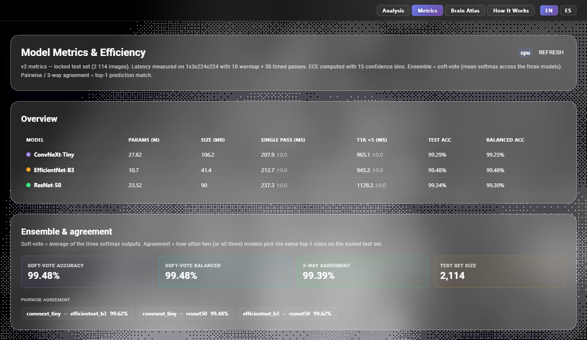

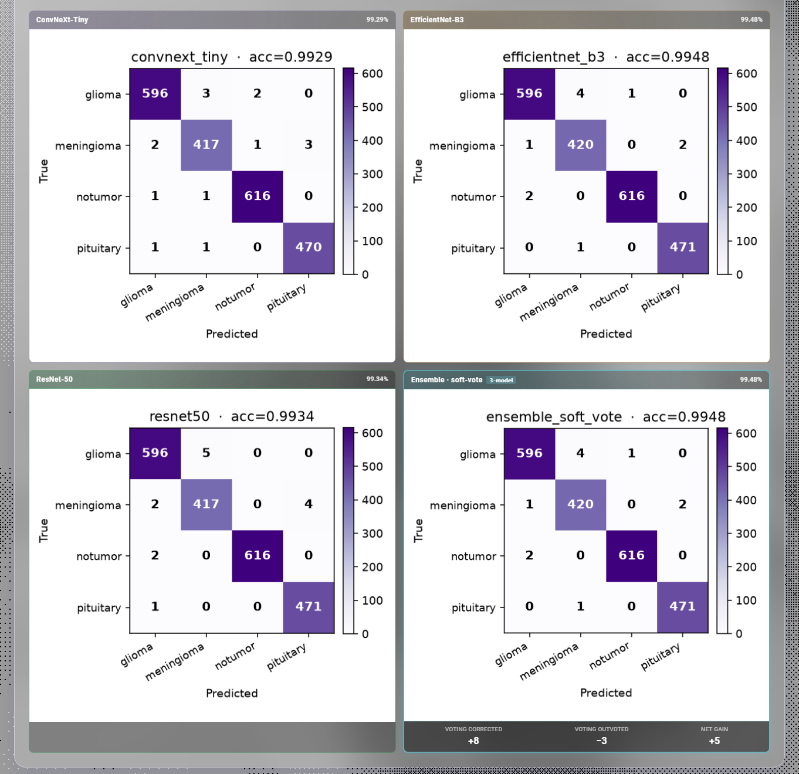

---

## 1. Why this project exists


### The problem

Brain tumors are among the most serious neurological illnesses there are. A
glioblastoma — the most aggressive kind of glioma — has a median survival of
about **15 months** even when treatment goes as well as it possibly can. (A
median of 15 months means half of patients live longer than that, half
shorter.)

But spotting a tumor is only half the question. The *type* decides what
happens next, and the answers are very different:

- A **grade I meningioma** is often just monitored, or removed in planned, non-urgent surgery.
- A **high-grade glioma** needs urgent treatment combining surgery, radiotherapy and chemotherapy.

Same scan, same "yes, there's a tumor" — completely different next step for
the patient.

MRI is the standard first scan for this. Reading one properly takes a trained
radiologist, and that expertise is not available everywhere, especially
outside large hospitals. This tool is not meant to replace that reading. It is
meant to give a second opinion, help sort the urgent cases first, and explain
to a patient in plain words what their scan appears to show.

### Where it started: the yes/no version

This project grew out of an earlier one that answered a much simpler question:
**is there a tumor, yes or no?** That version used a single ResNet-50 and was
built up in four steps. These are the numbers from its training log:

| Step | What was added | Accuracy | Missed tumors (FNR) |
|---|---|---:|---:|
| **A** | Baseline, frozen backbone | 97.5% | 2.7% |
| **B** | + data augmentation | 98.5% | 2.2% |
| **C** | **+ CLAHE + denoising** *(image processing)* | 98.8% | **1.4%** |
| **D** | + fine-tuning + TTA + adjusted threshold | **99.3%** | **0.3%** |

<picture>
  <source media="(prefers-color-scheme: dark)" srcset="assets/binary-ablation-dark.svg">
  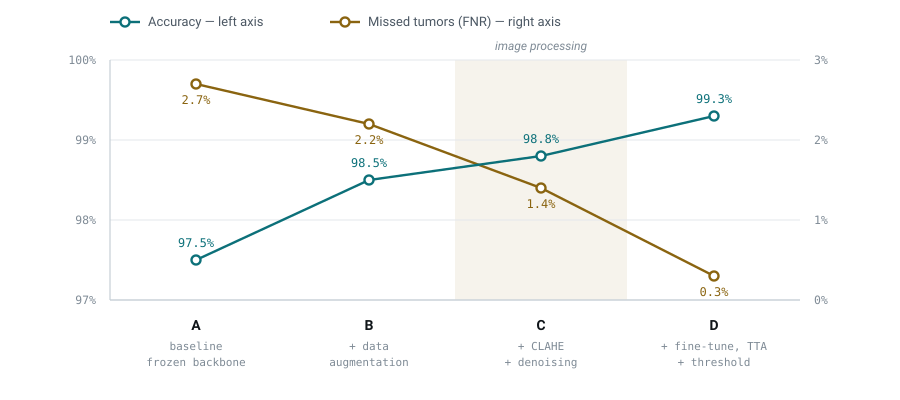
</picture>

Two things are worth pulling out of that:

- **Accuracy barely moved, but the misses collapsed.** Accuracy rose 1.8
  points in total (97.5% → 99.3%). Meanwhile the false-negative rate — the
  share of real tumors the model waved through as healthy — fell **nine-fold**,
  from 2.7% to 0.3%. In medical imaging that second number is the one that
  counts. A false alarm costs a follow-up scan; a missed tumor can cost a life.
- **Image processing did a large share of that work.** Step C added only 0.3
  points of accuracy, which looks like a rounding error — but it cut the miss
  rate by **more than a third** (2.2% → 1.4%). CLAHE evens out local contrast
  so a faint lesion stands out from the tissue around it, and denoising stops
  the model chasing scanner grain. Judged on accuracy alone, that step would
  have looked like it barely mattered.

That result is why CLAHE is still applied to **every** scan in the current
system rather than only to images that look low-contrast — it's step 2,
"clean up the image", in [§4](#4-how-it-works-step-by-step).

> These binary figures come from a different, smaller dataset than the one
> used here, so they are not directly comparable to the 99.48% multiclass
> accuracy reported below. They are included to show how the approach
> developed, not as a like-for-like benchmark.

### Why "yes or no" wasn't enough

99.3% on a yes/no question sounds close to solved. But by the time a brain MRI
is ordered, somebody already suspects a problem — so "yes, there's a tumor" is
rarely the useful part. What actually helps next is:

1. **Which type** of tumor is it likely to be?
2. **Where** is it, and **how big**?
3. **How sure** is the model really — not just what confidence number did it print?
4. **Why** did it decide that — what part of the image was it looking at?

The yes/no model answers none of those. So this project restarted in a clean
codebase — the earlier one is kept intact as a reference — and was rebuilt
around four classes (glioma, meningioma, pituitary tumor, no tumor), adding
one piece per unanswered question:

| Missing before | Added here |
|---|---|
| Which type? | Three CNNs (ConvNeXt-Tiny, EfficientNet-B3, ResNet-50) voting together, instead of betting on one architecture |
| Where and how big? | A YOLO11n detector for the box, MobileSAM to tighten it to the exact pixels |
| How sure, really? | MC Dropout, which runs the scan 20 times and measures how much the answer wobbles, plus a check for scans unlike anything in training |
| Why that answer? | Four levels of heat-map showing where the model looked, and a written report from a medical language model |

On top of that, and unlike the yes/no version, it ships a full React interface
built for a patient to actually use: English and Spanish throughout, an
interactive walkthrough of the pipeline, a bounding box you can redraw by hand
when the detector gets it wrong, and a symptom checklist that updates the risk
score as you tick items.

### How this compares to other work

**BraTS** is the best-known public benchmark in this field — a challenge
running since 2012 where teams compete at outlining brain tumors in MRI. Its
2025 edition covers gliomas, meningiomas, cancer that has spread from
elsewhere in the body, and scans taken before and after treatment.

Closer to what this project does, **DISCERN** — built by researchers at
Vall d'Hebron, VHIO and IDIBELL in Spain — tells three types of malignant
brain tumor apart from MRI alone, and gets about **78%** right.

That 78% is worth sitting with, because it puts the numbers further down this
page in perspective. Telling tumor *types* apart from an image is genuinely
hard. A research system scoring 99% on curated public datasets and a clinical
system scoring 78% on real hospital cases are not doing the same job under the
same conditions — the scans here are cleaner, more consistent, and already
sorted into tidy categories. The honest read is that this project performs
well *on its own benchmark*, which is a long way from performing well in a
clinic.

A team from UPM and CIBER-BBN, working with Children's National Hospital in
Washington, also won a recent segmentation challenge focused on gliomas.

The wider trend across the field is a move away from systems that only output
a prediction, toward ones a specialist can inspect and argue with. Regulators
including the FDA are explicit that a medical AI has to show it is safe,
effective and transparent — not just accurate.

---

## 2. What the system does


Upload one brain MRI slice and you get all of this back:

| What you get | How it's done |
|---|---|
| **The likely tumor type** — glioma, meningioma, pituitary, or none | Three computer-vision models vote on it (ConvNeXt-Tiny, EfficientNet-B3, ResNet-50), each shown five versions of the scan |
| **How confident it is — and how shaky that confidence is** | The scan is run 20 times with parts of the network randomly switched off. If the answer keeps changing, it isn't really sure (MC Dropout) |
| **A warning when the scan looks unlike anything it was trained on** | An energy score compared against the range seen in training |
| **A second look at the tumor on its own** | The image is cropped down to just the region the model focused on and classified again. A different answer means it was reading the background, not the lesion |
| **Heat-maps showing where it looked** | Four levels of detail: Grad-CAM, Grad-CAM++, LayerCAM at block 4, and a fused version |
| **A box around the tumor, and how big it is** | A YOLO11n detector draws the box, MobileSAM traces the outline, and MedGemma measures it independently as a cross-check |
| **A stress test** | The scan is re-run blurred, brightened and full of noise. Predictions that change under that are flagged as fragile |
| **A risk score out of 10** | The tumor type's baseline risk × how confident the model is × how large the lesion is — and it updates when you tick symptoms |
| **Where it sits in the brain** | A region label linked to an interactive 3D atlas with 11 labelled areas |
| **A written report** | MedGemma 1.5 4B running on your own machine — simple or detailed, English or Spanish |
| **A chat to ask follow-up questions** | The same model, answering either as a doctor would or in plain patient-friendly language, aware of this specific scan |

---

## 3. See it working


One real scan, start to finish. Every image below is a screenshot of the app
actually running — nothing is a mockup. For the same walkthrough with more
detail on each panel, see [`notebooks/demo.ipynb`](notebooks/demo.ipynb).

### Step 1 · Drop in a scan

Drag an MRI slice onto the panel, or click to browse. The tabs along the top
are the four areas of the app — analysis, metrics, a walkthrough of how it
works, and the English/Spanish switch. Further down this same page there are
ready-made sample scans from all three datasets, so you can try it without
having to find a scan of your own first.

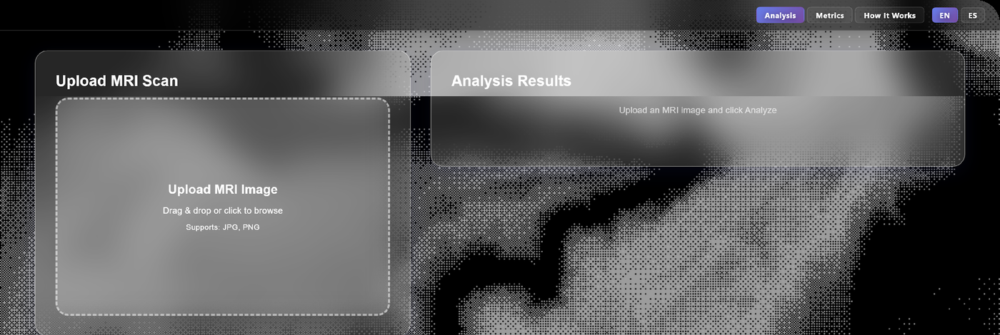

### Step 2 · The contrast gets fixed before anything else

Every scan goes through CLAHE first. This is the step that cut missed tumors
by a third back in the yes/no version — and here you can see why. On the
right, the lesion separates from healthy tissue in a way it simply doesn't on
the left.

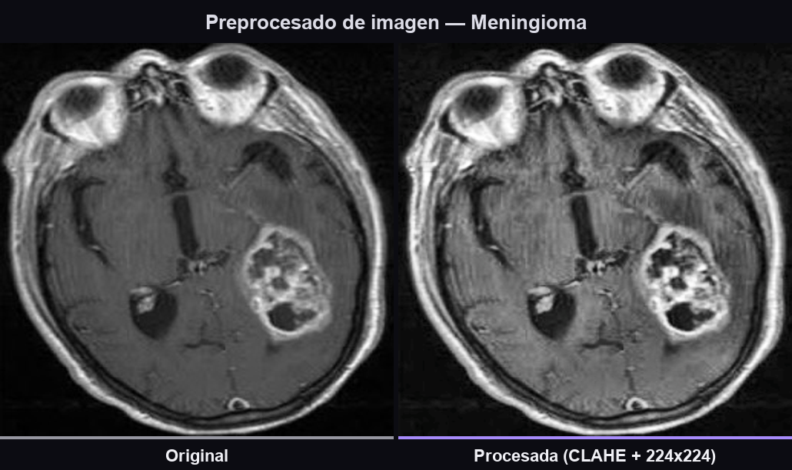

### Step 3 · Three models vote

Each model gives its own answer and its own confidence. When all three land on
the same class, that agreement is itself evidence. When they split, the system
says so rather than quietly picking the winner.

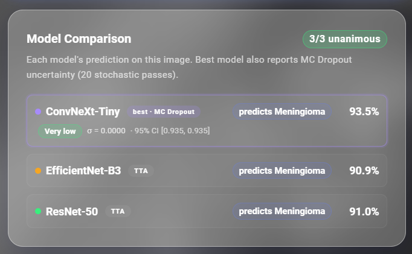

### Step 4 · It argues with itself

This is the part most classifiers skip. Even with a confident, unanimous
answer, five independent checks run — and any one of them can pull the scan
back for a human to look at. Here two fired: the uncertainty check, and the
re-check that crops away the background. So instead of a green result, you get
this.

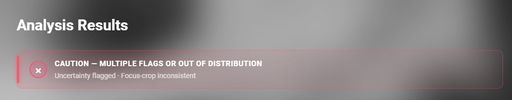

### Step 5 · The tumor gets found and measured

A detector draws the box, a segmentation model traces the outline, and the
size is worked out from the pixels. The medical language model measures the
same lesion independently from the raw image, and **both numbers stay on
screen** — if they disagree, you see the disagreement instead of an averaged
number hiding it.


### Step 6 · You can see where it was looking

Four heat-maps, each answering a different question: is there a tumor at all,
what type is it, where exactly, and how does the reasoning build up across the
network's layers. All four landing on the same spot is a good sign; if they
scattered, the model would be reading something other than the lesion.

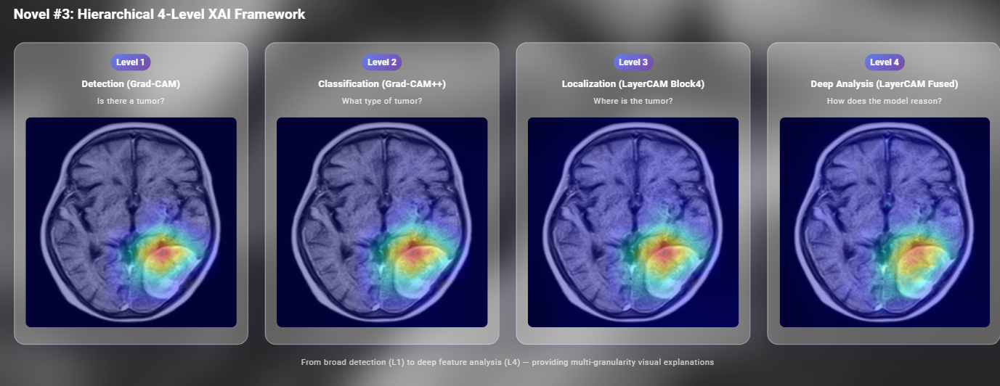

### Step 7 · What this type of tumor actually means

Everything marked **Reference** is fixed medical knowledge for the predicted
type — written down in advance, so it reads the same every time and isn't
something the language model invented on the spot. MedGemma's scan-specific
reasoning sits alongside it rather than replacing it. You can also tick
symptoms you've noticed, and the risk score updates as you go.

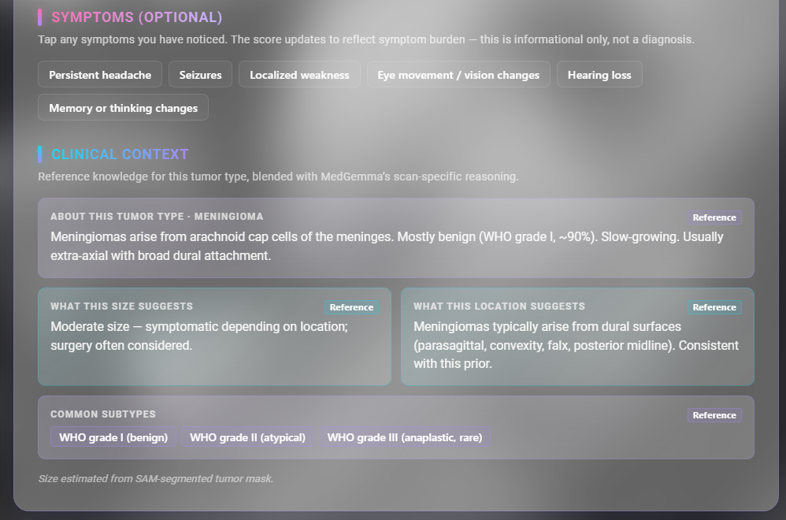

### Step 8 · Questions to take to your doctor, and other ways to look

A prepared list of follow-up questions specific to the predicted tumor type,
so a patient walks into the appointment with something to ask. Below it, the
same slice re-rendered in six colour maps — HOT picks out enhancement, BONE
sharpens edges, VIRIDIS pulls out subtle intensity changes that a single
grayscale view flattens away.

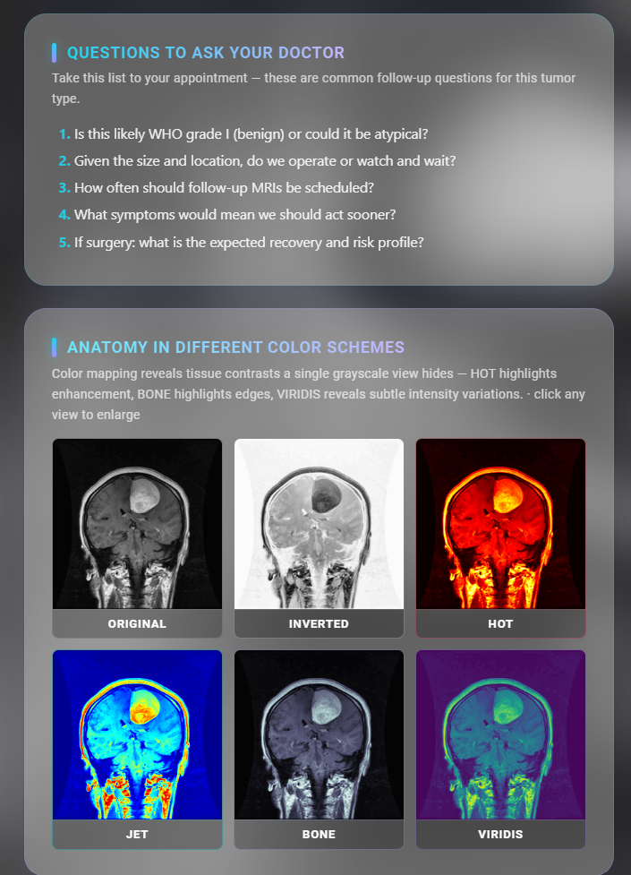

### Step 9 · A written report

MedGemma reads the scan and the pipeline's findings and writes them up, in
either a simple or a detailed version.

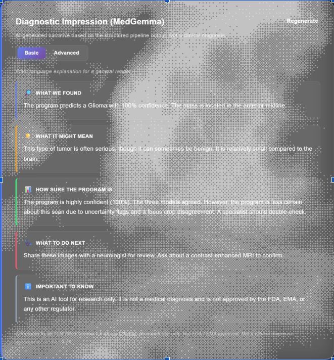

The whole interface is bilingual — the same report generated in Spanish, not
a translation layer bolted on afterwards:

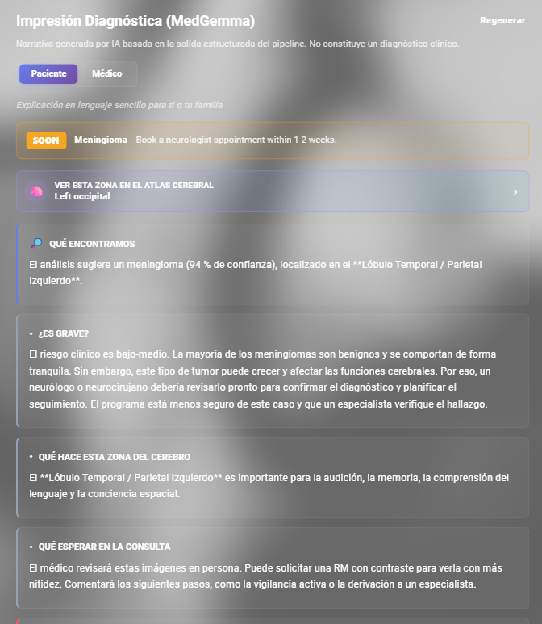

### Step 10 · Where it sits in the brain

The detected region links to an interactive 3D brain model with 11 labelled
areas, so "left temporal lobe" becomes something you can actually look at and
rotate.

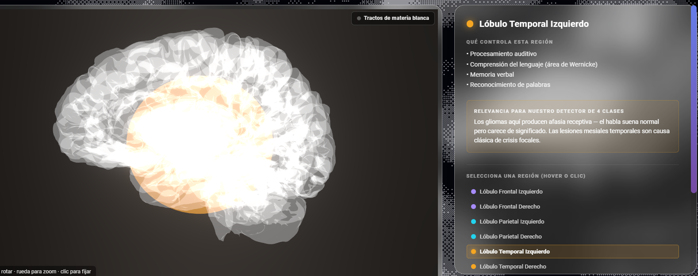

The report links straight into it, connecting the written finding to the
anatomy rather than leaving them in separate tabs:

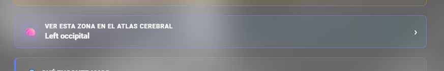

---

## 4. How it works, step by step


Everything that happens between dropping a scan on the upload panel and
reading the report, in nine plain-language steps. This is the real order
things run in [`app/app.py`](app/app.py), not a simplified sketch — three
CNNs, two models for finding and outlining the tumor, one medical language
model, and 40 passes through a network per scan.

<picture>
  <source media="(prefers-color-scheme: dark)" srcset="assets/pipeline-dark.svg">
  
</picture>

**Reading the colours** — teal is a neural network doing the work, amber is a
check that can raise a flag, violet is the medical language model, grey is
input, output and scoring. The dashed line running down the left is the
original image being carried along untouched: the tumor detector and the
language model need the real scan, not the resized, contrast-adjusted copy the
classifiers work from.

The amber rail down the right side is the part worth noticing. Five separate
checks — the three models disagreeing, the answer wobbling when the scan is
re-run, the prediction breaking under noise, the scan looking unfamiliar, and
the model changing its mind once the background is cropped away — all feed the
same flag. Any single one of them turns the verdict amber, so a confident-looking
score never reaches the user unchallenged.

Two design decisions the diagram makes visible:

- **The supervised detector leads, the heat-map follows.** Grad-CAM++ shows
  what the classifier *looked at*, which is frequently not the lesion itself.
  YOLO11n draws the box, MobileSAM tightens it to pixels, and the CAM is
  demoted to a fallback seed.
- **Size is measured three ways and ranked, not averaged.** YOLO pixel area
  wins when it fires; otherwise a MedGemma-seeded SAM re-segmentation; only
  if both fail does MedGemma's free-text estimate count. Both estimates stay
  visible in the UI so a disagreement is obvious rather than silently
  resolved.

The backend is a single Flask process that loads every model into memory
once at startup (avoiding repeated cold-starts on each request) and exposes
a REST API — predict, explain, chat, metrics — consumed by a React frontend
served as static files from that same process. Ollama runs alongside it as
a separate local service for MedGemma.

---

## 5. Folder layout


```
Tumor-detection/
├── README.md                      ← this file
├── assets/
│   ├── pipeline-{light,dark}.svg  ← the pipeline flowchart in §4
│   └── binary-ablation-*.svg      ← the yes/no-model improvement chart in §1
├── paper/
│   └── brAIn_paper_en.pdf         ← full write-up (English translation of the original report)
├── notebooks/
│   └── demo.ipynb                 ← executed walkthrough of the full pipeline
├── app/                           ← runnable application
│   ├── app.py                     ← Flask backend (HTTP server on :7860)
│   ├── requirements.txt           ← Python dependencies
│   ├── cheng_yolo.pt              ← YOLO weights for tumor bbox (not tracked in git — see below)
│   ├── llm/                       ← MedGemma client + Ollama prompts
│   ├── preprocessing/              ← brain extraction, CLAHE, denoising
│   ├── models/                    ← trained weights (not tracked in git — see below)
│   │   └── v2/                    ← CNN ensemble (ConvNeXt + EffNet + ResNet)
│   ├── static/                    ← built React UI + 3D brain atlas GLBs
│   ├── frontend/                  ← React source (npm run build → static/)
│   └── src/                       ← training + evaluation scripts
│       ├── train_v2.py            ← train any of the 3 backbones
│       └── eval_v2.py             ← test-set metrics + confusion matrices
├── dataset/                       ← combined, deduplicated split (not tracked in git)
│   ├── train/  val/  test/
└── reports/                       ← evaluation metrics + confusion matrices (tracked)
```

**Not tracked in git**: `dataset/` (~280 MB), `app/models/` (~430 MB — individual
checkpoints exceed GitHub's 100 MB file limit), `app/frontend/node_modules/`,
`app/.venv/`. These are excluded via `.gitignore` to keep the repo a browsable
portfolio piece rather than an asset dump — see the demo notebook or
`reports/` for pre-computed results, or the setup steps below to run it
yourself with your own weights/dataset.

---

## 6. Requirements


| Component | Version | Why |
|---|---|---|
| **Python** | 3.11 (torch's CPU wheel doesn't yet support 3.12+) | Backend |
| **Node.js** | 18+ | Frontend (only if rebuilding UI) |
| **Ollama** | latest | Serves MedGemma 1.5 4B locally |
| **GPU** | Optional — NVIDIA recommended for training | Inference runs fine on CPU (`torch==2.2.0+cpu`); MedGemma calls are slower without a GPU (a few minutes per report on CPU vs. seconds on GPU) |
| **OS** | Windows 10/11, Linux | Tested on both Windows 11 (CPU-only) and Linux + RTX GPU |

---

## 7. First-time setup


### 5.1 Install Python dependencies

```powershell
cd app
py -3.11 -m venv .venv
.venv\Scripts\Activate.ps1
pip install -r requirements.txt
```

### 5.2 Pull MedGemma into Ollama

```powershell
# Install Ollama first: https://ollama.com/download
ollama pull medgemma1.5:4b
```

To verify: `ollama list` should show `medgemma1.5:4b`.

### 5.3 Provide model weights and dataset

Not included in this repo (see §5). Either train your own (§9) or place
existing checkpoints at `app/models/v2/{convnext_tiny,efficientnet_b3,resnet50}.pth`
and a MobileSAM/YOLO checkpoint at `app/models/mobile_sam.pt` / `app/cheng_yolo.pt`.

### 5.4 (Optional) Rebuild the frontend

The `static/` folder already contains the built UI. Only rebuild if you modify React source:

```powershell
cd app\frontend
npm install
npm run build
# then copy build output back into ../static/
xcopy /E /I /Y build\* ..\static\
```

---

## 8. Running the app


```powershell
cd app
py app.py
```

You should see:

```
[BOOT] Importing libraries...
[BOOT] All imports OK
Pre-loading models...
[get_models] loading v2 weights from models/v2/
[get_models] v2 ensemble loaded (3 models)
Starting server on port 7860...
 * Running on http://127.0.0.1:7860
```

Open **http://127.0.0.1:7860** in a browser.

### Using the UI

1. Drag-and-drop or click to upload an MRI image (PNG / JPG)
2. Click **Analyze MRI**
3. Results panel shows:
   - Tumor type + confidence, per-model agreement
   - Uncertainty / OOD / Focus-Crop self-check
   - Malignancy assessment with bbox + size (pipeline estimate + independent MedGemma estimate)
   - Hierarchical Grad-CAM/LayerCAM visual explanations
   - Adversarial robustness score
   - MedGemma diagnostic report (Basic / Advanced toggle, EN / ES)
   - Brain atlas region link
4. **Floating chat (bottom-right)** — ask follow-up questions to MedGemma about the scan; switches between Patient and Doctor audience

### Language

Toggle EN ↔ ES with the language switcher in the header. Reports, chat, UI labels, and clinical text all translate.

---

## 9. Retraining the CNN ensemble


```powershell
cd app
py src\train_v2.py --model convnext_tiny  --epochs 40 --batch 32
py src\train_v2.py --model efficientnet_b3 --epochs 40 --batch 32
py src\train_v2.py --model resnet50       --epochs 40 --batch 32
```

Two-phase fine-tuning from ImageNet weights (frozen-backbone warm-up, then
full unfreeze with cosine-annealed LR), class-weighted sampling, mixup, and
label smoothing. Reads from `../dataset/train` and `../dataset/val`, and
saves checkpoints under `models/v2/`.

### Data augmentation

Every one of the 9,867 training images is re-augmented independently, on
the fly, every epoch — nothing augmented is ever written to disk. Over a
40-epoch run that works out to **394,680 distinct stochastic views** of the
training set (9,867 × 40), averaging roughly 2.5 transformations applied
per view:

| Transform | Probability | Views over 40 epochs | Why |
|---|---:|---:|---|
| Horizontal flip | 0.50 | ≈197,340 | Tumor type doesn't depend on left/right side — laterality comes from the bounding box, not the flip |
| Rotation ±15° | 0.50 | ≈197,340 | Brain anatomy tolerates this range; larger angles break radiological convention |
| Brightness/contrast ±20% | 0.50 | ≈197,340 | Robustness to exposure differences between acquisitions |
| CLAHE | 0.50 | ≈197,340 | Same contrast-enhancement recipe used at inference time |
| Gaussian noise (σ=0.01) | 0.30 | ≈118,404 | Simulates acquisition noise without erasing real detail |
| Elastic transform (mild) | 0.20 | ≈78,936 | Simulates inter-scanner geometric variability |

Deliberately **not** applied: vertical flip (superior/inferior anatomical
direction matters — flipping it isn't a valid augmentation) and strong
color perturbation (T1 MRI is essentially grayscale, so it wouldn't
generalize to anything real). Source: `src/train_v2.py` →
`build_train_transform()`.

### Evaluating

```powershell
py src\eval_v2.py
```

Prints test-set accuracy, per-class precision/recall/F1, and writes a confusion matrix + `reports/v2_metrics.json` (the exact numbers the app's Metrics page reads).

---

## 10. Dataset


Combined from three publicly available brain MRI datasets — **BRISC-2025**,
**Mendeley** (Epic/CSCR Hospital), and **Kaggle** (Nickparvar) — deduplicated
against each other by MD5 hash (4 classes, T1-weighted axial slices):

| | Total | Glioma | Meningioma | No Tumor | Pituitary |
|---|---:|---:|---:|---:|---:|
| Raw (3 datasets) | 25,264 | 6,974 | 6,164 | 5,439 | 6,687 |
| After MD5 dedup | 14,095 | 4,011 | 2,821 | 4,121 | 3,142 |
| Train · 70% | 9,867 | 2,808 | 1,975 | 2,885 | 2,199 |
| Val · 15% | 2,114 | 602 | 423 | 618 | 471 |
| Test · 15% | 2,114 | 601 | 423 | 618 | 472 |

11,169 duplicates were discarded — ~44% of the raw pool, expected given the
three source datasets share a large amount of underlying scans. The
stratified 70/15/15 split is applied *after* dedup, and the test partition
is never touched during training or any hyperparameter tuning — every
number in this README's Results section comes from that one locked set.

BRISC-2025 additionally contributes tumor segmentation annotations; a
separate dataset from **Jun Cheng** (Figshare, 3,064 radiologist-annotated
MRIs, patient-disjoint train/val split) is used specifically to train the
YOLO11n tumor-localization detector.

---

## 11. Results in detail


**Classification.** All three backbones exceed 98.7% accuracy and macro F1
on the combined test set. EfficientNet-B3 is the strongest individual
model — 99.48% accuracy, 99.46% macro F1 — and also the most balanced across
classes: No Tumor scores highest (F1 99.76%), Pituitary close behind
(99.68%), Glioma at 99.33%, and Meningioma the lowest at 99.06% (still a
small gap, not a meaningful degradation). ConvNeXt-Tiny replaced a prior
DenseNet-169 backbone in this version, trading a small amount of accuracy
for a substantial latency win.

**Tumor localization (YOLO11n).** Evaluated on a patient-disjoint validation
split of the Cheng dataset — no patient appears in both train and eval:

| Metric | Value | Meaning |
|---|---:|---|
| mAP50 | 0.918 | Detection counts as correct at IoU > 0.50 |
| mAP50-95 | 0.563 | Stricter — averaged across IoU 0.50→0.95 |
| Precision | 0.907 | Of the boxes it draws, how many are right |
| Recall | 0.828 | Of the real tumors, how many it catches |

The gap between mAP50 and mAP50-95 says the detector reliably finds the
right *region* but its box edges aren't segmentation-grade precise — which
is exactly why MobileSAM refines the box into a pixel-tight mask
downstream, rather than using the raw YOLO box directly for sizing.

**Ensemble voting.** The soft-vote ensemble matches EfficientNet-B3's
99.48% accuracy while pulling 3-way model agreement up to 99.39% — voting
corrects 8 test-set cases where at least one model was wrong, and only
overturns 3 cases where a single model had been right, a net +5 over
picking any one model alone.

**Binary → multiclass, in context.** The team's earlier binary
tumor/no-tumor classifier (also ResNet-50-based, built incrementally with
augmentation, CLAHE, deep fine-tuning, TTA, and a lowered decision
threshold) reached ~99.3% accuracy with a 0.3% false-negative rate — a
strong result for its narrower question. This project doesn't just add
classes on top of that; it's a structural extension: tumor *type*,
uncertainty, OOD detection, visual explainability, supervised localization,
and clinical narrative generation are all new, not just more label options.

---

## 12. Limitations & future work


This is an experimental support tool, not a validated clinical system —
these are the concrete gaps between where it is now and where it would need
to get to:

- **Data diversity.** Training data is currently axial T1 slices from three
  public datasets. Real clinical use would need BraTS 2023/2024,
  anonymized hospital data, and multiple sequences (T1, T1c, T2, FLAIR) —
  plus cross-dataset validation reported *per source*, to catch domain
  shift rather than average it away.
- **No clinical validation yet.** No radiologist has compared the system's
  output against expert judgment. That comparison — agreement rate, and
  which cases the tool actually helps with — is a prerequisite before this
  moves anywhere near a real workflow.
- **Localization, not segmentation.** YOLO11n + MobileSAM give a bounding
  box and a pixel-tight mask, not a clinically-validated segmentation.
  A natural next step is fine-tuning something purpose-built for medical
  segmentation (e.g. MedSAM, possibly via LoRA on the Cheng dataset) and
  evaluating with Dice / IoU / Hausdorff distance against expert
  annotations.
- **No automatic sequence detection.** The system doesn't yet verify that
  an uploaded scan is the T1 sequence it expects — a wrong sequence could
  silently degrade the analysis.
- **Single VLM.** MedGemma 1.5 4B hasn't been benchmarked against
  alternatives (e.g. Qwen3-VL) for report quality, stability, or
  clarity.
- **OOD thresholds are stale.** `models/tumor_ood_calibration.json` is keyed
  for the v1 checkpoints (`densenet169`, `efficientnetb3`, `resnet50`), but
  the deployed v2 ensemble uses `convnext_tiny` and `efficientnet_b3` —
  neither has an entry, so the energy-based OOD check is skipped whenever one
  of them is the best model. Only `resnet50` matches by name, and it inherits
  a threshold calibrated on different weights. Recalibrating against the v2
  validation split is the fix; until then the other four review flags carry
  that responsibility.
- **Local-only, single-user.** Current deployment has no encryption,
  access control, or auto-deletion policy — fine for a local research tool,
  not for handling real patient data. Any real deployment would need to
  account for GDPR (EU) / HIPAA (US) requirements from the start.

---

## 13. Troubleshooting


| Symptom | Fix |
|---|---|
| `Could not reach Ollama at http://127.0.0.1:11434` | Run `ollama serve` in another terminal, or check Ollama is installed |
| MedGemma report/assessment fails or times out | MedGemma 1.5 sometimes emits chain-of-thought instead of the requested format, especially on CPU. `llm/medgemma_client.py` has `_strip_thinking` (reports) and `_parse_assessment_json` (tumor size/location) to recover from this; click **Regenerate** to retry |
| MedGemma calls are very slow (minutes) | Expected on CPU-only inference — a 4B vision-language model has no GPU acceleration here. Budget a few minutes per report/assessment; timeouts are set generously (300–420s) to accommodate this |
| `CUDA out of memory` | Lower `--batch` (try 16 or 8); close other GPU apps |
| Port 7860 already in use | Kill the old process: `Get-NetTCPConnection -LocalPort 7860 \| Stop-Process -Id $_.OwningProcess -Force` |
| Frontend shows old version | Hard-refresh with `Ctrl + Shift + R` or clear cache |
| "no estimate" in MedGemma size card | MedGemma returned non-JSON text; check the Flask console for `[MedGemma assess] parse status=...` — `regex` means some fields were recovered, `failed` means none were |

---

## 14. References


- Dorfner, J. F., et al. (2025). *A review of deep learning for brain tumor analysis in MRI.* NPJ Precision Oncology, 9, Article 2.
- Louis, D. N., et al. (2021). *The 2021 WHO Classification of Tumors of the Central Nervous System.* Neuro-Oncology, 23(8), 1231–1251.
- Kouli, O., et al. (2022). *Automated brain tumor identification using MRI: A systematic review and meta-analysis.* Neuro-Oncology Advances, 4(1).
- Hu, E. J., et al. (2021). *LoRA: Low-Rank Adaptation of Large Language Models.* [arXiv:2106.09685](http://arxiv.org/abs/2106.09685)

**Datasets**: [BRISC-2025](https://www.kaggle.com/datasets/briscdataset/brisc2025) · [Mendeley Brain Tumor MRI](https://data.mendeley.com/datasets/zwr4ntf94j/1) · [Nickparvar (Kaggle)](https://www.kaggle.com/datasets/masoudnickparvar/brain-tumor-mri-dataset)

**Tools & models**: ConvNeXt-Tiny / EfficientNet-B3 / ResNet-50 (ImageNet pretrained) · [MobileSAM](https://github.com/ChaoningZhang/MobileSAM) · [Ultralytics YOLO11](https://docs.ultralytics.com/models/yolo11) · [MedGemma](https://deepmind.google/models/gemma/medgemma/) via [Ollama](https://ollama.com/) · [React](https://react.dev/) · [Flask](https://flask.palletsprojects.com/)

---

## License


Research / educational use only. Not for clinical decisions. The system is an academic project (TFG) and has not been validated by any regulatory authority (FDA, EMA, etc.).

